# 🚨 VisionSentinel – Real-Time Suspicious Object Detection System

An **AI-powered**, **privacy-first**, and **web-based** surveillance solution for **exam proctoring**, **public safety**, and **human-centric monitoring**.  
Built during **HackOrbit 2025** by Team **AIvengers**.

---

## 🧠 Project Summary

**Team Name:** AIvengers  
**Hackathon:** HackOrbit 2025 – MITS Gwalior  
**Members:**

- 👨‍💻 Anikesh Kumar – Full Stack & AI Developer
- 👩‍💻 Aishwarya G M – UI/UX & Testing Engineer

---

## 🎯 Project Vision

To develop a **real-time suspicious object detection system** that runs entirely in-browser (Edge AI), triggering alerts and maintaining logs, with full user control — all without compromising privacy.

---

## 📁 Directory Structure

```
src/
├── App.tsx
├── main.tsx
├── index.css
├── vite-env.d.ts
└── components/
    ├── AlertBanner.tsx
    ├── BoundingBoxDemo.tsx
    ├── ConceptsOverview.tsx
    ├── DetectionLogs.tsx
    ├── DetectionSettings.tsx
    ├── ObjectDetectionDemo.tsx
    ├── PoseDetection.tsx
    ├── RealTimeDetection.tsx
    └── YOLOArchitecture.tsx
```

---

## 🧩 Component Descriptions

| File                      | Purpose                                                                |
| ------------------------- | ---------------------------------------------------------------------- |
| `App.tsx`                 | Main layout and router for the application                             |
| `main.tsx`                | React entry point                                                      |
| `index.css`               | TailwindCSS styling and global styles                                  |
| `AlertBanner.tsx`         | Displays visual alerts and triggers sound when suspicious object found |
| `BoundingBoxDemo.tsx`     | Interactive tool to manually draw bounding boxes                       |
| `ConceptsOverview.tsx`    | Educational component explaining Computer Vision & Object Detection    |
| `DetectionLogs.tsx`       | Records and displays all suspicious detections with export support     |
| `DetectionSettings.tsx`   | Lets user choose object classes, alert preferences, thresholds         |
| `ObjectDetectionDemo.tsx` | Demo version to simulate how object detection works                    |
| `PoseDetection.tsx`       | Detects posture/pose to track cheating via head/movement               |
| `RealTimeDetection.tsx`   | Main AI engine – loads model, renders webcam, and detects in real-time |
| `YOLOArchitecture.tsx`    | Visual breakdown of how the YOLO model works                           |

---

## 🔧 Tech Stack

| Layer         | Tools Used                     |
| ------------- | ------------------------------ |
| Frontend      | React, TypeScript, TailwindCSS |
| AI Framework  | TensorFlow.js, COCO-SSD, YOLO  |
| Visualization | Canvas API, HTML5, Audio API   |
| Dev Tools     | Vite, GitHub, draw.io, Netlify |

---

## 🧭 Hackathon Checkpoint Plan

| CP  | Goal                                  | Files Involved                                                                         |
| --- | ------------------------------------- | -------------------------------------------------------------------------------------- |
| CP1 | Kickoff & folder setup                | Project init, Tailwind setup                                                           |
| CP2 | UI Layout Scaffold                    | `App.tsx`, `main.tsx`, Tailwind layout, placeholder sections                           |
| CP3 | Live Webcam + Object Detection (TFJS) | `RealTimeDetection.tsx`, `@tensorflow-models/coco-ssd`, webcam, canvas, detection loop |
| CP4 | Alert System + Pose Monitoring        | `AlertBanner.tsx`, `PoseDetection.tsx`, `App.tsx`, risk score, suspicious pose alerts  |
| CP5 | Detection Logs + Risk Calculation     | `DetectionLogs.tsx`, `App.tsx`, timestamp logs, filters, risk scoring                  |
| CP6 | Detection Settings Panel              | `DetectionSettings.tsx`, user control for classes, sound, sensitivity, logging         |
| CP7 | Learning Visualizations               | `ConceptsOverview.tsx`, `YOLOArchitecture.tsx`, CV education with YOLO visual grid     |
| CP8 | Final YOLO Detection Integration      | `RealTimeDetection.tsx`, YOLOv8 model, live object detection, risk scoring, alert flow |
| CP9 | Final Polishing & Deployment Ready    | Code cleanup, UI polish, README update, final demo review                              |

---

## 📸 Checkpoint Progress Screenshots

<table>
  <tr>
    <td align="center"><strong>CP1 – Initialization</strong></td>
    <td align="center"><strong>CP2 – UI Layout</strong></td>
  </tr>
  <tr>
    <td>
      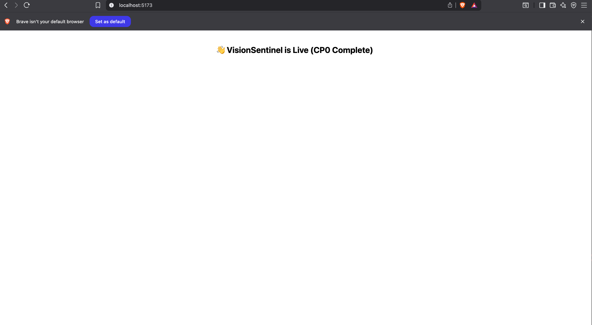
    </td>
    <td>
      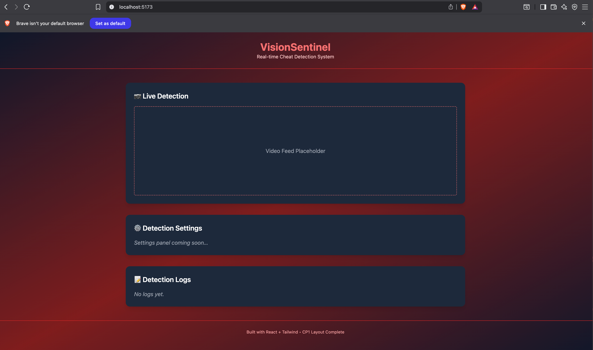
    </td>
  </tr>
</table>

<table>
<caption><strong>CP3-Live Webcam + Object Detection </strong></caption>
  
  <tr>
    <td>
      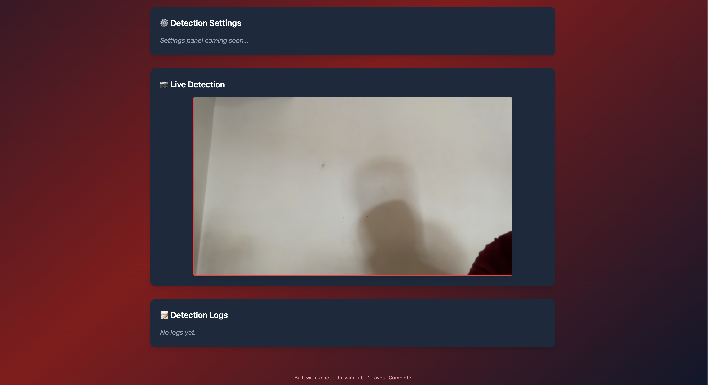
    </td>
    <td>
      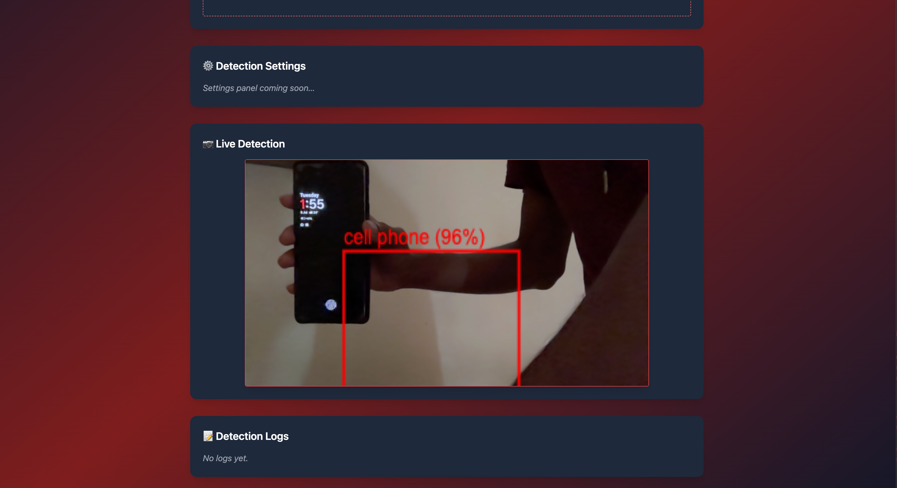
    </td>
   
  </tr>
</table>

<table>
<caption><strong>CP4-Alert System + Pose Monitoring </strong></caption>
  
  <tr>
    <td>
      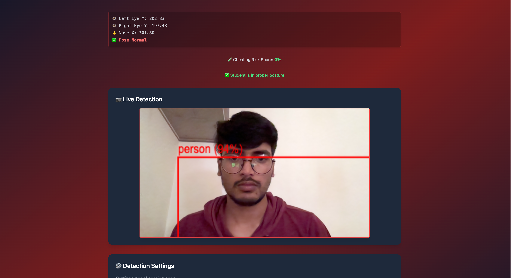
    </td>
    <td>
      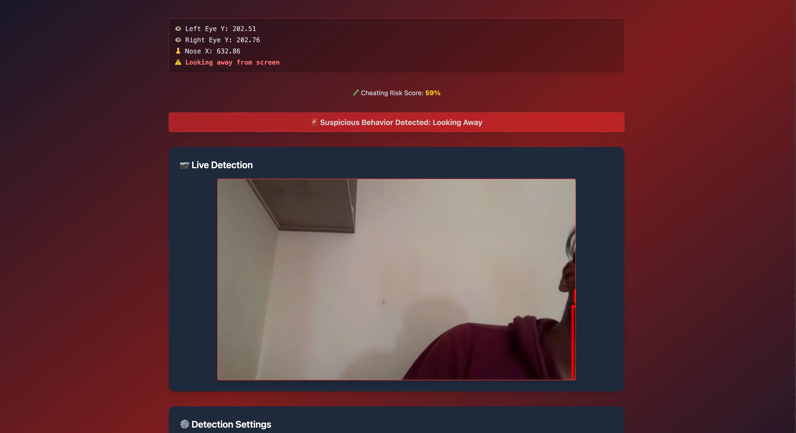
    </td>
   
  </tr>
</table>
</table>
<table>
<caption><strong>CP5-Detection Logs + Risk Calculation</strong></caption>
  
  <tr>
    <td>
      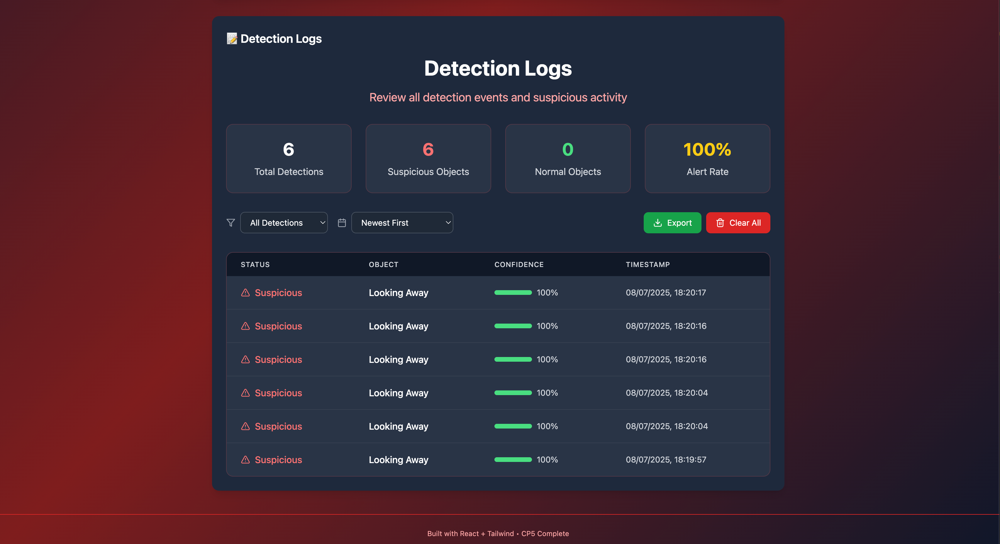
    </td>
    
  </tr>
</table>
<table>

<caption><strong>CP6-Detection Settings Panel</strong></caption>
  
  <tr>
    <td>
      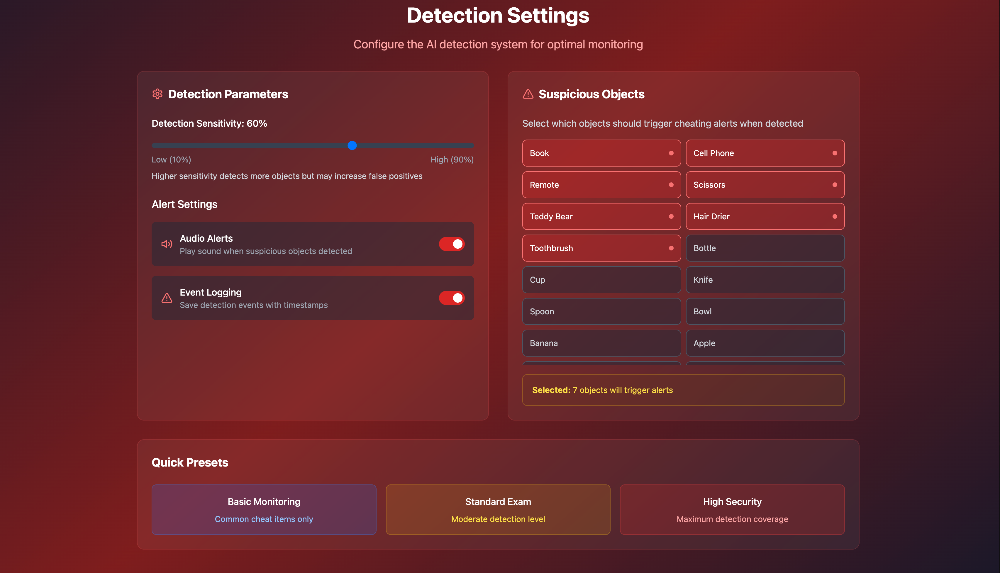
    </td>
    
   
  </tr>
</table>
<table>

<caption><strong>CP7-Learning Visualizations</strong></caption>
  
  <tr>
    <td>
      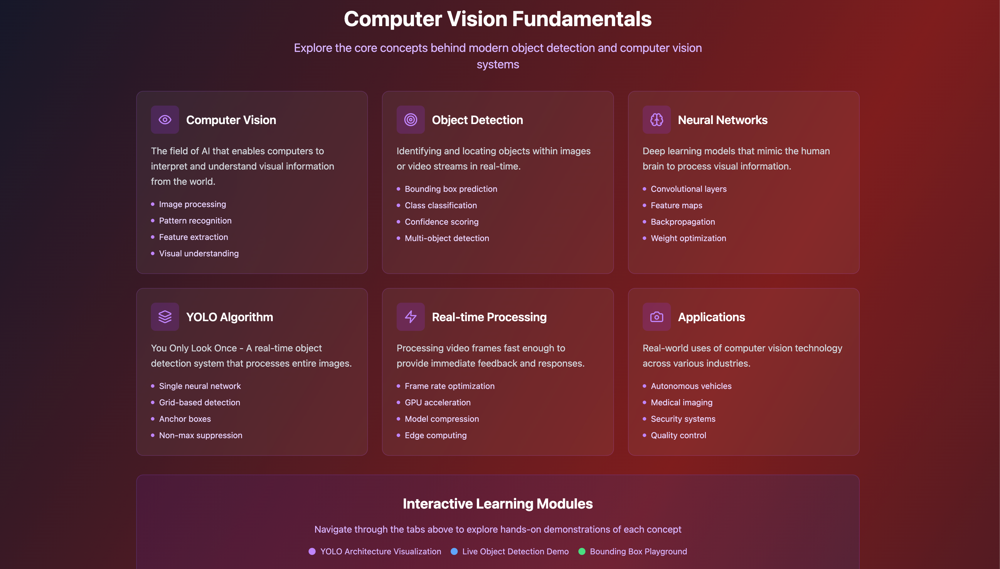
    </td>
     <td>
      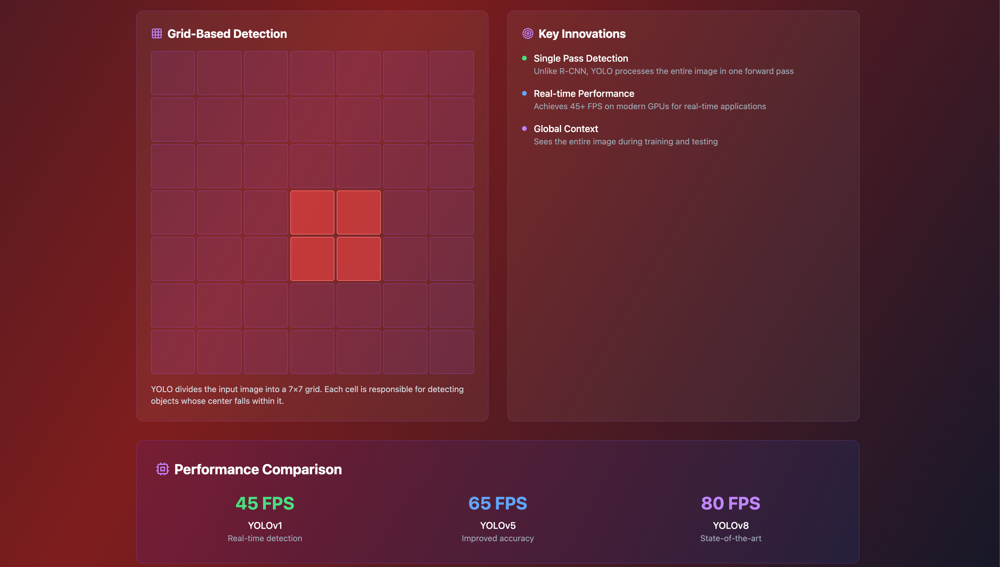
    </td>
   
  </tr>
 
</table>
<table>
<caption><strong>CP8-Final YOLO Detection Integration</strong></caption>
  
  <tr>
    <td>
      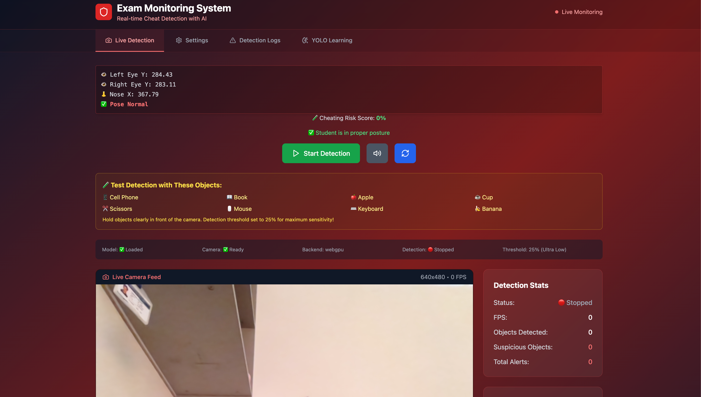
    </td>
     <td>
      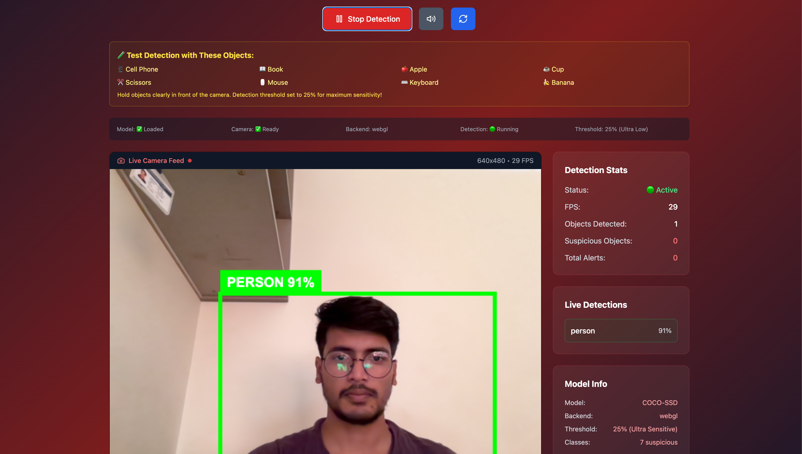
    </td>
   
  </tr>
  <tr>
    <td>
      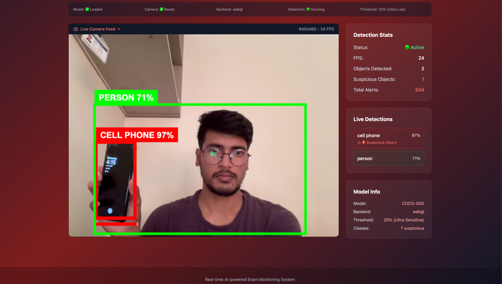
    </td>
     <td>
      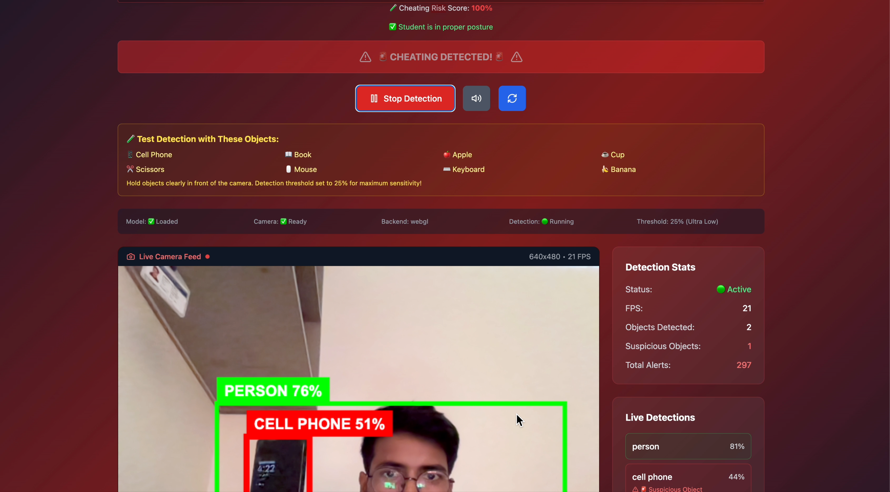
    </td>
   
  </tr>
 
</table>

---

## 💡 How It Works

1. 📷 Webcam feed accessed via HTML5
2. 🧠 YOLO / COCO model loads via TensorFlow.js
3. 🟩 Suspicious objects detected in real-time
4. 🔊 Alerts triggered visually and via sound
5. 🗂 Logs saved with timestamps and object type
6. 🧘‍♂️ Posture changes tracked (via Pose Detection)

---

## 📦 Install & Run

```bash
git clone https://github.com/Anikesh0001/ProctoVision.git
cd ProctoVision
npm install
npm run dev
```

> Visit: `http://localhost:5173` in Chrome  
> ✅ Allow camera permissions

---

## 🚀 Features

- 🎯 Real-time Object Detection (YOLO via TensorFlow.js)
- 🔐 Privacy-first (Edge AI, no cloud)
- 🔊 Alerts with banner + audio
- 🗃️ Detection log history + export
- ⚙️ User customization (object class, sensitivity)
- 🧠 Built-in CV education (YOLO layers, concepts)
- 🧘 Pose tracking to prevent cheating posture

---

## 👥 Team AIvengers

- **Anikesh Kumar** – AI Developer, Backend, Integration
- **Aishwarya G M** – UI/UX, Testing, Frontend Logic

---

## 📬 Contact

- 📧 Anikesh: anikeshkr0001@gmail.com
- 📧 Aishwarya: aishwaryagirish1211@gmail.com
- 🔗 GitHub: [https://github.com/Anikesh0001/ProctoVision](https://github.com/Anikesh0001/ProctoVision)

---

_Made with ❤️ for HackOrbit 2025 — Built ethically, deployed intelligently._
